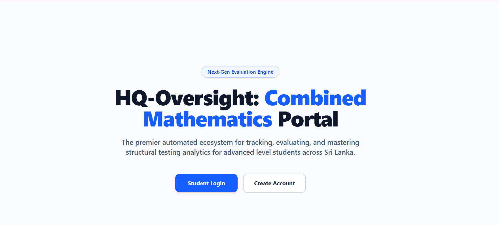
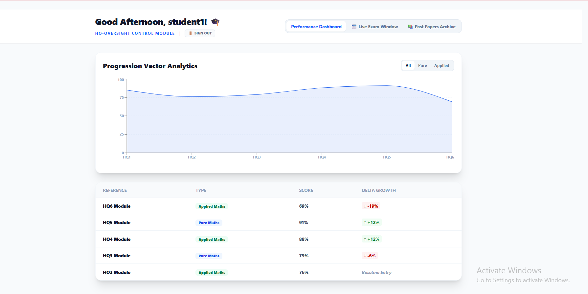

# HQ-Oversight: Combined Mathematics Evaluation Engine (Frontend)

An enterprise-grade, high-performance automated testing and analytics ecosystem engineered for tracking, evaluating, and mastering structured testing datasets for Advanced Level students. This system bridges production-level automation with educational testing metrics, providing seamless evaluation tracking, real-time live examination enforcement, and dynamic progression vector analytics.

🔗 **Live Deployment:** [hqmaths.netlify.app](https://hqmaths.netlify.app/)

---

## 🚀 Core Engine Architecture Overview

The system architecture decouples user operations into a highly responsive, atomic React frontend and a multi-tiered backend built for data integrity and low-latency throughput.

* **System Layout:** Monolithic React SPA integrated with a FastAPI (Python) backend using an optimized PostgreSQL relational database tier.
* **Decoupled State Management:** Uses centralized local cache tokens and interceptor pipelines to maintain high-speed UI transitions independent of backend structural calculations.

---

## 🛠️ Technical Stack & Operational Tooling

### Frontend Architecture
* **Core Library & Compiler:** React 18, Vite (for rapid HMR, optimized production build chunking, and static configuration compilation)
* **Styling Engine:** Tailwind CSS (Engineered using fluid design grids, semantic layout tokens, and strict uniform components)
* **HTTP Engine:** Axios (Configured with custom request interceptor layers and explicit connection timeout policies)

### Cloud Infrastructure & Security Orchestration
* **Static Asset Hosting:** Netlify (Continuous Deployment linked via production build hooks)
* **Transactional Security Pipeline:** Integrated secure passkey and automated token allocation via Resend SMTP relays.

---

## 💎 Critical Engineering Features Implemented

### 1. Dynamic Performance Analytics Grid
* **Advanced Vector Analytics:** Renders chronological progression data with automated trend evaluation.
* **Conditional State Evaluation:** Dynamically computes delta-growth score deviations on the client side, assigning real-time visual indicator badges based on positive/negative metrics.

### 2. Live Examination Module & Enforcement Link
* **Isolated Session Validation:** Features an integrated countdown enforcement matrix utilizing persistent active timers to monitor and secure active test intervals.
* **Asynchronous Script Dispatch:** Implements drag-and-drop target handlers to pipeline completed files smoothly across multipart network boundaries.

### 3. Comprehensive Global Evaluation Registry Ledger (Admin Console)
* **Dynamic Matrix Tracking:** Full operational access controls allowing managers to deploy target question repositories, control answer keys, audit submissions queues, and monitor the global ledger.
* **Multi-Parametric Filter Indexing:** Optimized client-side table rendering with reactive regex filtering fields across student properties and paper identification keys.

### 4. Enterprise Security Passkey Integration
* **Cryptographic Verification:** Protects account workflows by issuing multi-digit, temporary self-destructing session check codes delivered via automated background mail loops.

---

## 📡 Advanced Network Optimization & Middleware Resilience

### Axios Network Resilience Configuration

* To mitigate cold-start connection latency typical of distributed free-tier cloud containers, the engine's connection module is reinforced with connection pooling protections and programmatic communication safeguards:

* Trailing Slash Isolation: Stripped terminal slash anomalies systematically from raw API environment variables to prevent protocol formatting conflicts (400 Bad Request or routing failures).

* CORS Compliance: Synchronized precise secure HTTPS origin protocols (https://hqmaths.netlify.app) with the backend middleware registry to bypass browser preflight verification rules seamlessly.

## 🛠️ Local Development Installation

### 1. Clone the repository:
```bash
git clone [https://github.com/your-username/hq-oversight-frontend.git](https://github.com/your-username/hq-oversight-frontend.git)
cd hq-oversight-frontend
```

### 2. Install clean node dependencies:
```bash
Install clean node dependencies:
```

### 3. Setup environment runtime variables:
Create a .env file in the root root directory:
```
VITE_API_BASE_URL=http://localhost:8000
```

### 4. Launch local development server:
```
npm run dev
```

## 📈 System Gallery & Architectural Layouts

### 1. Unified Landing Platform
*The premier automated entry ecosystem for advanced structural testing metrics.*


### 2. Progression Analytics Space
*Visualizes real-time delta tracking and mathematical score variance across evaluated milestones.*


### 3. Active Examination Terminal
*Secures real-time evaluation windows backed by strict session countdown monitors.*


### 4. Verification & Recovery Lifecycle Mailers
*Protects transaction scopes via temporary cryptographic verification passkeys and recovery bridges.*
<p align="left">
  
  
</p>

### 5. Control Desk Matrix Ledger (Administrative Center)
*Central core interface built to scale data indexing, queue auditing, and target paper distributions.*


